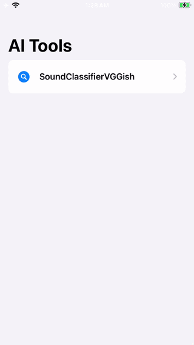
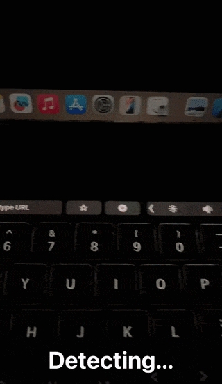

This project is for example of CoreML model.

Have a question about his Repo, ask in DeepWiki 

Sentimental Analysis sample

**Text Classification**

**Word Tagging**

**Image Style Transfer(Softner)**

**Sound Classifier(Cat, Dog and Noise)**

**Hand Pose Classifier(ThumbsUp and OpenPalm)**

